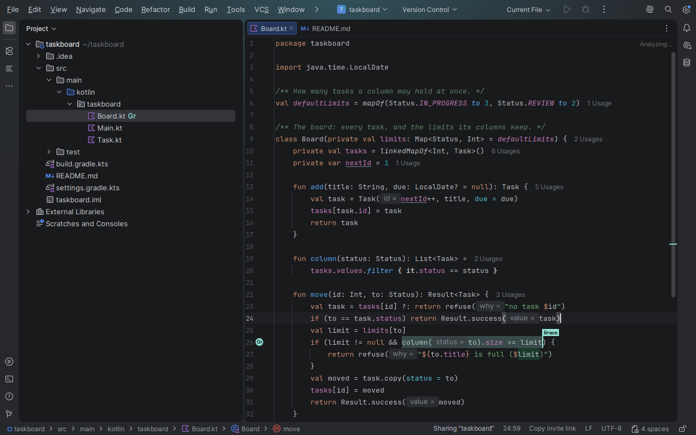

# Selvage for JetBrains IDEs

A JetBrains IDE client for the [Selvage session protocol](https://github.com/selvage-protocol/specification):
share a link, come edit my code with me.



Status: published on the [JetBrains Marketplace](https://plugins.jetbrains.com/plugin/34763-selvage)
as `Selvage`. Hosting, joining by invite, editing together, carets, go to and follow all work today.

## Get it working

You need:

- An IDE built on the IntelliJ Platform 2026.2 (build 262) or newer: IntelliJ IDEA, PyCharm,
  WebStorm, GoLand and the rest.
- A `selvaged` to connect to. Start one and note the address it prints. A guest needs only the
  invite link the host sends.

Install it in the IDE: **Settings → Plugins → Marketplace**, search `Selvage`, then install.

Or build the plugin and install the zip:

```sh
./gradlew :plugin:buildPlugin
```

Then in the IDE: **Settings → Plugins → ⚙ → Install Plugin from Disk…**, and pick
`plugin/build/distributions/selvage-<version>.zip`. The first build downloads the IntelliJ IDEA the
plugin is compiled against into `~/.gradle`, about 1.5 GB. With Nix, run it inside `nix develop`.

A first session:

1. Open the project you want to share, then run **Tools → Selvage → Host a session**. Answer its
   one question with the address `selvaged` printed; a domain on its own means `wss://<domain>`.
   The invite link goes on the clipboard as the room opens.
2. Send the link. The other person runs **Join a session from an invite link** and pastes it. The
   room opens in a new window of their IDE, on a folder holding the room's files, and lands in the
   first document anyone has open.
3. Both edit the same file, and each sees the other's text and caret as they type.

## Commands

All twelve are in **Tools → Selvage**, in **Find Action**, and in the menu that opens when you
click the session's name in the status bar. Their names are the ones the VS Code and Neovim
clients use.

| | |
|---|---|
| Host a session | Open a room on the server and share this project's folders. Asks for the server once and remembers it. One folder means the room's paths are that folder's own; a project with several shares all of them, each path starting with the name of the folder it is in. |
| Join a session from an invite link | Join the room the link names, in a new window on a copy of the room's files. |
| Copy the invite link | Put the invite on the clipboard. The status bar's `Copy invite link` reads `Copied` for a moment. |
| Open a document from the room | Open one of the room's documents. A host is told its own files are the room's. |
| Download a file from the room | Fill a file, or the whole listing, from the room. Downloading opens the file in the room, so everyone there gets its text. |
| Leave the session | Leave. A host is asked first, because leaving ends the room for everyone. |
| Set the name other participants see | Say the name in force, with a button to change it. |
| Change the server | Say the server the next host uses, with a button to change it. |
| List the room's participants | Everyone in the room, you first; pick a person to go to them, follow them or rename yourself. |
| Go to a participant | Put your caret where they are. |
| Follow a participant | Keep landing where they are until you type, move or stop. |
| Stop following | Stop, or say there is nothing to stop. |

The **Selvage** tool window lists the same people as the participants command, and the project
view marks a file with the initials of whoever is in it.

[Command behaviour](docs/commands.md) has what each command asks, says and refuses, and where this
client differs from the VS Code one and why.

## Settings

**Settings → Tools → Selvage**:

| | |
|---|---|
| Server URL | The server to host on. Set it and hosting never asks. |
| Display name | The name other participants see, up to 32 characters with an emoji counting as two. A change renames a live session. |
| Save a document the room changed | On by default. Off leaves a remote edit unsaved in the editor. |
| Open the room's first document on join | On by default. |
| Cursor label | Off (default), Above the caret or Beside the caret: whether and where a peer's name is drawn at their caret. |

[Configuration](docs/configuration.md) has the details and where the settings are stored.

## More

- [Command behaviour](docs/commands.md): every command's questions, answers and refusals, and
  where this client differs from the VS Code one.
- [Configuration](docs/configuration.md): the settings, their defaults and what they change.

## Licence

`MIT OR Apache-2.0`: [LICENSE-MIT](LICENSE-MIT) and [LICENSE-APACHE](LICENSE-APACHE).
