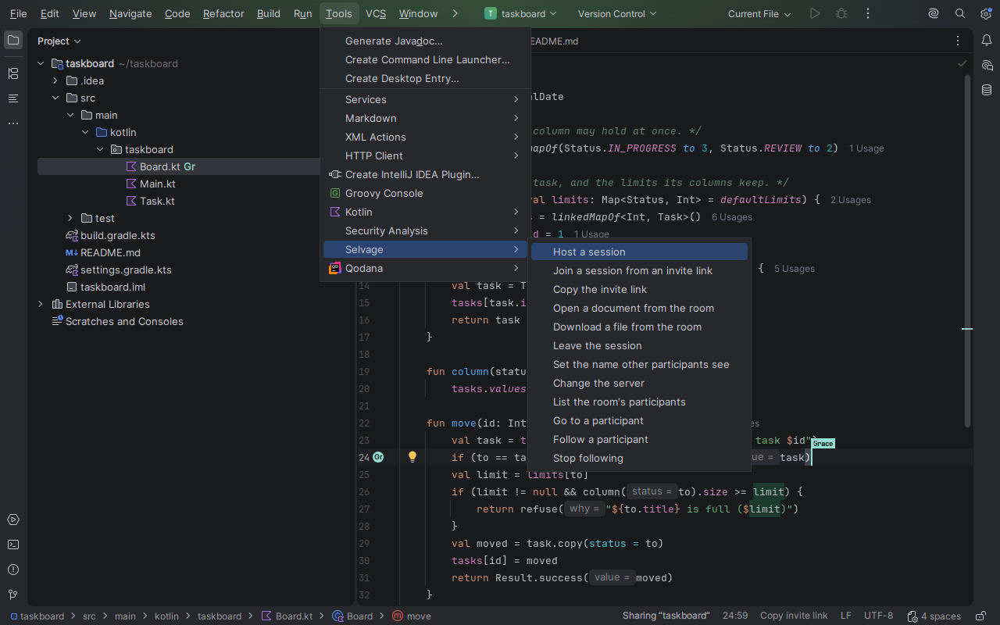
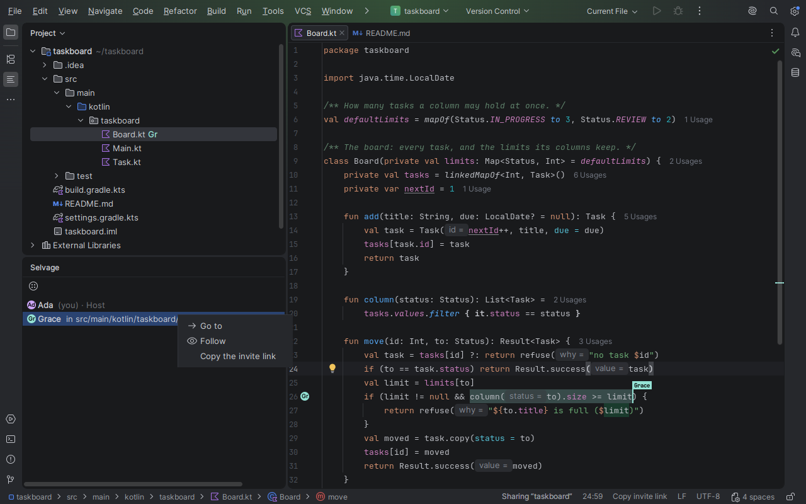
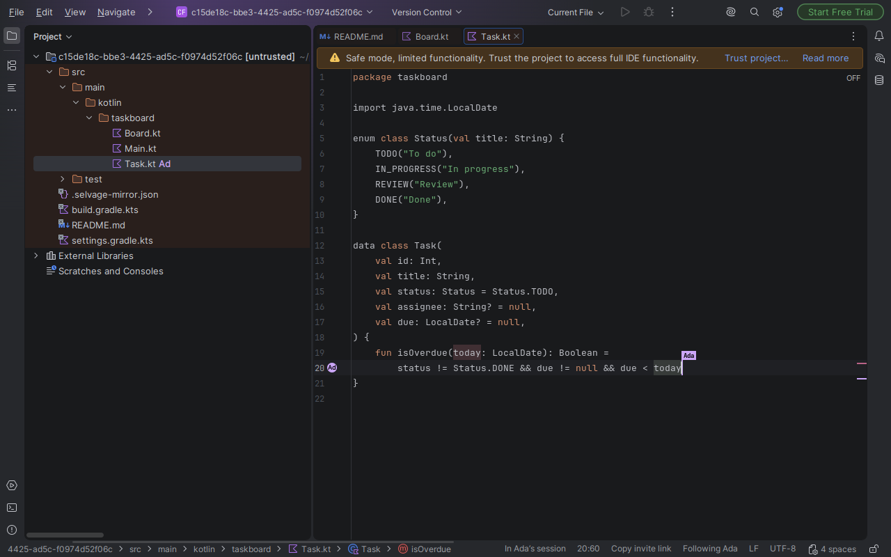

# Command behaviour

The twelve commands share their names, their sentences and their order of questions with the
VS Code and Neovim clients. A sentence is shown as a notification in the **Selvage** group, as
`Selvage: <sentence>.`, at the level the other clients use. The room's own lines (the host going
away and coming back, the room ending, a follow that ends on its own, the host's leave question)
are shown as they stand, without the `Selvage: ` in front, as VS Code shows them.

A question is an input dialog, a list or a dialog with one affirming button and Cancel. A list
that names people keeps itself in step with the room while it is open: a person who leaves is
dropped, a rename is redrawn, and the list closes when nobody is left to pick.

## Host a session

1. A window with no project folder is refused: `open a folder first — hosting shares the folder
   this window is open on, and a room from a window with no folder would share nothing.`
2. Already hosting: the invite is copied again and nothing else happens. In someone else's room:
   `you are in this session; hosting a session means leaving it first.`, with **Leave and host**.
3. The server: the **Server URL** setting, else the address used last, else one question
   prefilled with the demo server. The address is remembered.
4. The display name: the setting, else the name given last, else one question.
5. A modal progress dialog reads `Selvage: connecting to <address>…` and the status bar reads
   `Connecting…`. A refusal is said with its reason; a remembered address adds **Change the
   server**.
6. `the room is open. Send this link to your friend — it is on the clipboard.`, with **Copy again**.

The project's folder is the grant. What a host leaves out is the VS Code client's list, which
includes `.idea`, and the folder's own ignore files narrow it further. A file a peer asks for is
read from disk with every step of its path checked, so a link out of the folder is refused.

## Join a session from an invite link

The invite question starts empty: the clipboard is not read. A link whose fragment names one of
the two keys and not the other is refused before anything is dialled. The room opens as a new project window on a folder the plugin
keeps under the IDE's system directory, `selvage/rooms/<room>/<window>/Selvage session`, holding
one file per listed path. That project opens untrusted, in the IDE's safe mode, because its build files are the
host's and joining a room is not agreeing to run them. When you join with a project already open,
the IDE asks where to open the room unless you told it not to ask.

The notice is VS Code's: `joined the room, opening <path>.`, with `<n> more files are open.` and an
**Open a document from the room** button when there are more. The room's project settings
(`.idea/**`, `.run/**`, `*.run.xml`, `*.iml`, `*.ipr`, `*.iws`) are not written into the copy, and that is said once.

When the host stops sharing a file you have open, its editor closes, or, if you have unsaved edits
in it, it stays open and on disk but is no longer shared. Either way it is said, in VS Code's words.

When the session ends, the copy and its window go. When the room ends under you, the copy is kept
and the sentence says where.

## The others

- **Copy the invite link**: no notification on success. A refused clipboard says why.
- **Open a document from the room**: one document opens at once; several give a list whose footer
  reads `<n> open in this room`.
- **Download a file from the room**: a list with **Fetch the whole listing (<n> files)** first; the
  whole listing asks first and is capped at 100 files. While the text is on its way, the IDE's
  background task reads `Selvage: fetching <path>…`. A path the host stopped sharing is refused
  with the reason. `fetched the files.` when everything arrived.
- **Leave the session**: a host is asked `Leaving ends the room for everyone and stops the invite
  link.`, with **Leave anyway**, and the room is closed for everyone before the session ends.
  Closing the project leaves too, and a host's room closes without asking.
- **Set the name other participants see** and **Change the server**: a notification with the
  value in force and a button that asks for a new one.
- **List the room's participants**: a list titled with the session, footer `Everyone in the room`.
  A row opens that person's menu: **Go to**, **Follow** or **Stop following**, and **Rename** on
  your own row.
- **Go to** and **Follow**: with one other person there is no list. A follow ends silently when you
  go somewhere or stop it, and with a sentence when you type, move, the person leaves or their file
  goes.

The **Selvage** tool window has the same rows, and a row's context menu the same actions:

A guest following the host, in the window the room opened on its copy of the files:

A viewer's documents are read-only in the editor, and `you are a viewer in this room, so its
documents are read-only.` is said once, as a warning. The room's edits still reach them.

## While you edit

A peer's name, caret and selection are drawn where they are, and only the primary caret is shared:
extra carets stay yours. While a modal dialog is open in your IDE the room's changes to your
documents wait and land when it closes, because the platform does not allow a document write under
a modal dialog. Your own typing normally goes out as you type; an edit that has to be merged with
something already in flight is queued and goes out with the rest when the dialog closes.

## Where this client differs from the VS Code client, and why

Each of these is this editor's own shape; none removes a command.

| What | VS Code | Here | Why |
|---|---|---|---|
| Where a joined room opens | The window reloads onto the room's folder, after asking `joining replaces this window's folder…` | A new project window; your own project stays open | An IntelliJ window holds one project and opening another does not replace it, so there is nothing to warn about. The IDE asks where to open it when a project is open. |
| Restricted Mode for the room's folder | Workspace trust | The project opens untrusted, in safe mode | The IDE's own form of the same protection. |
| Workspace settings left out of the copy | `.vscode/**`, `*.code-workspace` | `.idea/**`, `.run/**`, `*.run.xml`, `*.iml`, `*.ipr`, `*.iws`, said in this client's own sentence | Those are the files this IDE would apply rather than show. |
| A host with several folders | Paths qualified `<folder>/<path>` | One folder, the project's base | A project has one base directory. |
| Clicking the session's name | The people list | The Selvage menu, with the people list in it and in the tool window | The menu reaches all twelve commands from the status bar, which has no palette beside it. |
| A viewer's keystroke | Put back to the room's text | Refused by the editor: the document is read-only | The IDE can mark one document read-only; VS Code cannot, so it puts the text back. |
| A failed save | The save's answer and its cause | A read-only file, a save the IDE refused, or one it held back is said; a write the IDE finishes in the background and that fails later is reported by the IDE's own notification | This platform writes files asynchronously and keeps the failure to itself. |
| A hosting window that loses its connection | The session ends: `this client cannot resume a hosting session, so it will not reconnect.` | The session detaches, retries on the room's own URL and comes back inside the room's grace; a retry that gives up ends it with the guest's sentence | A dropped socket is not a leave, so the session retries while the room's grace lasts. |

